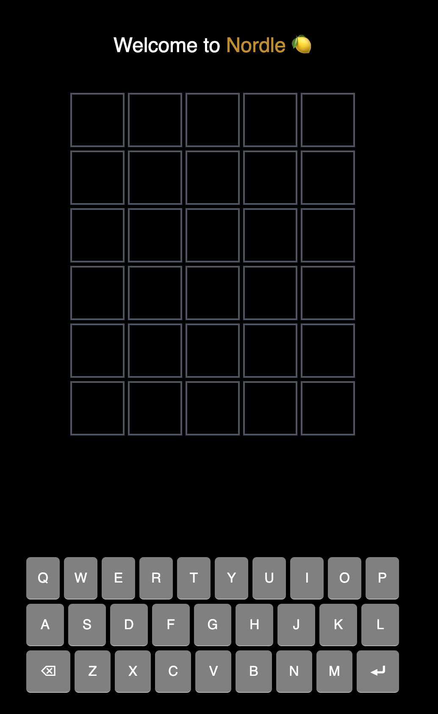
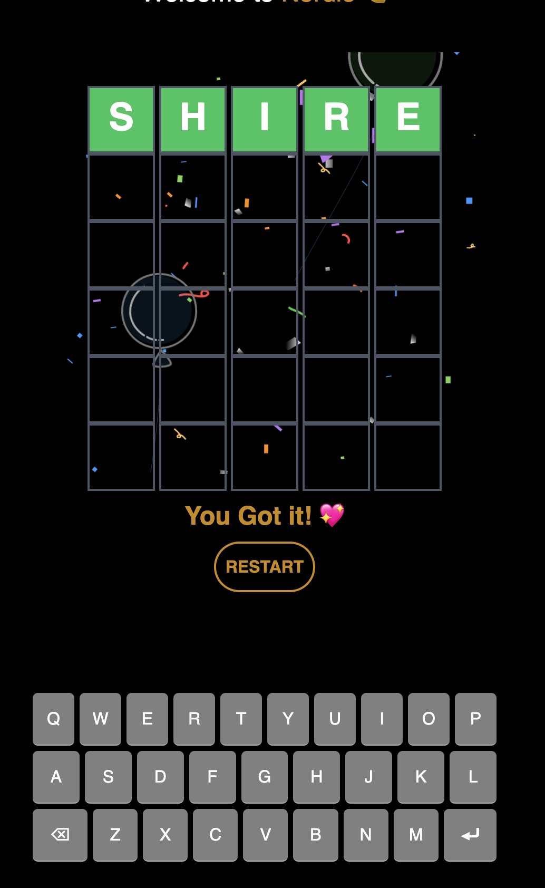

# Nordle

Nordle is a simple, worlde clone written in Typescript.

## Sample Images

The game is responsive and will scale to fit the window and on different devices (mobile, tablet, desktop).

It also ships a virtual keyboard for mobile devices.

## Rules and How To Play

Same way you place wordle, check out this guide:
<https://www.wikihow.com/Play-Wordle>

## The winning Screen

